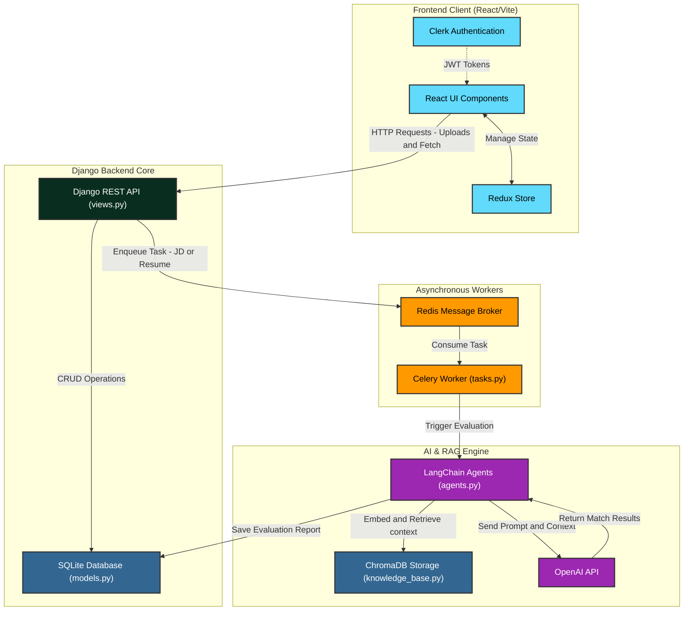

# Matcha AI

Matcha is an AI-powered resume and job description (JD) matching platform. It evaluates candidate resumes against job descriptions using Retrieval-Augmented Generation (RAG) and advanced AI agents. 

## 📌 Project Status

**Current State:** 
- ✅ Resume parsing and JD matching algorithms are implemented.
- ✅ The core backend (Django) and frontend (React/Vite) structure is established.
- 🚧 The AI agents (`core/agents.py`) need further refinement.
- 🚧 Additional frontend dashboards and views need to be added.
- 🚧 General bug fixing and polishing are pending.

**What all things are to be made:**
- Refinement of the RAG (Retrieval-Augmented Generation) pipeline for resume evaluation.
- Completing the HR and Candidate dashboards on the frontend.
- Integrating user authentication flows with Clerk to the backend.
- Full end-to-end integration of the AI evaluation results into the frontend UI.

## 🎉 Recent Updates
- **AI Interview Integration (Beyond Presence AI)**: Integrated the Amrita AI agent via a seamless iframe implementation.
- **Enhanced Proctoring Engine**: Calibrated head-turn and look-away heuristics to reduce false positives and improved TensorFlow video processing.
- **Automated Interview Invitations**: Developed a Celery background task (`send_interview_email_task`) that sends beautifully styled HTML emails to candidates upon scheduling.
- **HR Dashboard UI Refactor**: Transformed the HR Dashboard into a modern Master-Detail split layout (a left-hand candidate card list and a massive right-hand rich profile view) utilizing `react-hot-toast` for elegant notifications.

## 📂 File Structure

The project is structured into two main parts: the Django backend and the React frontend.

```text
matcha/
├── matcha_backend/      # Django project settings and configuration
├── core/                # Main Django application
│   ├── agents.py        # AI logic, LangChain/OpenAI integrations
│   ├── knowledge_base.py# Logic for RAG and vector embeddings
│   ├── tasks.py         # Celery tasks for asynchronous processing
│   ├── models.py        # Database models (SQLite)
│   └── views.py         # API endpoints
├── matcha_frontend/     # React frontend application (Vite + TailwindCSS)
│   ├── src/
│   │   ├── components/  # Reusable UI components
│   │   └── pages/       # Dashboard and page layouts
├── chroma_storage/      # Local vector database storage for RAG
├── docker-compose.yml   # Docker configuration for Redis
└── manage.py            # Django management script
```

## 🏗 Architecture & Data Flow



## 🛠 Tech Stack

**Frontend:**
- **React (Vite)**
- **Tailwind CSS**
- **Redux Toolkit** (State Management)
- **Clerk** (Authentication)
- **DnD Kit** (Drag & Drop functionality)

**Backend:**
- **Django** & **Django REST Framework**
- **Celery** (Background tasks)
- **Redis** (Message broker for Celery via Docker)
- **SQLite** (Database)

**AI Stack:**
- **OpenAI API**
- **ChromaDB** (Vector database for RAG)
- **LangChain** (for AI agent orchestration)

---

## 🚀 How to Run Locally

### Prerequisites
- Python 3.10+
- Node.js 18+
- Docker & Docker Compose (for Redis)

### 1. Backend Setup

1. **Create and activate a virtual environment:**
   ```bash
   python -m venv env
   # On Windows:
   .\env\Scripts\activate
   # On macOS/Linux:
   source env/bin/activate
   ```

2. **Install Python dependencies:**
   *(Ensure you install the required packages. If a requirements.txt exists, run `pip install -r requirements.txt`. Otherwise install django, celery, redis, etc.)*

3. **Set up Environment Variables:**
   Create a `.env` file in the root directory (where `manage.py` is) with your secrets:
   ```env
   OPENAI_API_KEY=your_openai_api_key_here
   ```

4. **Start Redis (via Docker):**
   ```bash
   docker-compose up -d
   ```

5. **Run Database Migrations:**
   ```bash
   python manage.py migrate
   ```

6. **Start the Django Development Server:**
   ```bash
   python manage.py runserver
   ```

7. **Start the Celery Worker (in a new terminal):**
   ```bash
   # Make sure your virtual environment is active!
   # On Windows:
   celery -A matcha_backend worker -l info --pool=solo
   # On macOS/Linux:
   celery -A matcha_backend worker -l info
   ```

### 2. Frontend Setup

1. **Navigate to the frontend directory (in a new terminal):**
   ```bash
   cd matcha_frontend
   ```

2. **Install Node modules:**
   ```bash
   npm install
   ```

3. **Set up Environment Variables:**
   Create a `.env.local` file in `matcha_frontend/` and add your Clerk publishable key:
   ```env
   VITE_CLERK_PUBLISHABLE_KEY=your_clerk_key_here
   ```

4. **Start the Vite Development Server:**
   ```bash
   npm run dev
   ```

The frontend will be available at `http://localhost:5173` and the backend API at `http://localhost:8000`.
